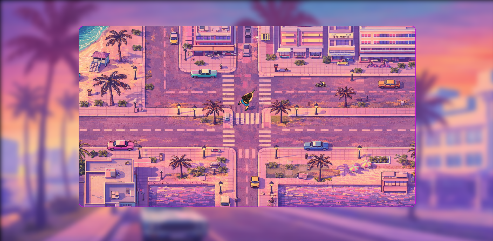
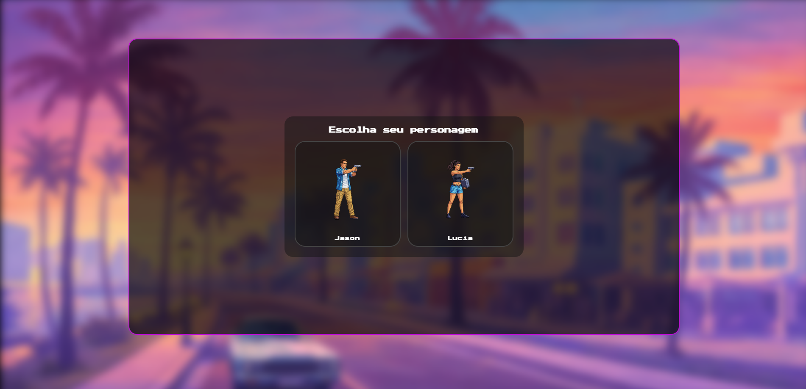

# Six Pixels

**Six Pixels** is a top-down 2D pixel game inspired by the classic GTA 1 & GTA 2 experience, reimagined with a modern neon / GTA 6–inspired aesthetic.

The project is built entirely with **HTML5 Canvas and vanilla JavaScript**, focusing on clean game logic, pixel-art visuals, and an expandable city system.

---

## 🎮 Concept

The idea behind Six Pixels is simple:

- Classic **top-down GTA-style gameplay**
- **Pixel-art city** with neon / Miami vibes
- Smooth character movement and rotation
- Modular map system designed to be **infinite / expandable**
- Clean and readable code, made for learning and evolution

This project is both a **game prototype** and a **learning project**, exploring how classic mechanics can be rebuilt from scratch using modern web technologies.

---

## 🗺️ World & Map

- Top-down city inspired by **GTA 1 & GTA 2**
- Designed as **tileable map sections**
- Each map image can connect seamlessly on all sides
- Supports infinite scrolling via scripting

The map visuals follow a pink / purple neon palette inspired by GTA 6 promotional art.

---

## 🧍 Characters

- Character selection screen at game start
- Top-down sprites
- Smooth rotation based on mouse direction
- Walking animation using PNG frame swapping
- Sprite forward direction configurable per character

---

## 🛠️ Tech Stack

- HTML5
- CSS3
- JavaScript (Vanilla)
- Canvas API

No frameworks. No engines. Full control.

---

## 📸 Screenshots

